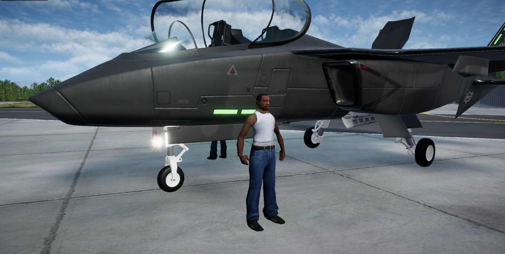

# Nuclear Option: Pilot Model Replacer
Mod for Nuclear Option that replaces the pilot model with another character. This mod comes with 5 different characters that you can swap the pilot with

[Video Demonstration](https://www.youtube.com/watch?v=LV2A84NOMGQ)



# Installation
To install this mod, make sure you have [BepInEx](https://github.com/BepInEx/BepInEx) installed on your copy of Nuclear Option. 
In [Releases](https://github.com/BruhBoi50/NuclearOption-PilotModelReplacer/releases), Download and extract the .zip file and move the "PilotModelReplacer" folder into the "BepInEx\plugins" folder.

After running the game once, open the "BepInEx\config\com.bruhboi.pilotmodelreplacer.cfg" file in a text editor. Here, you can set the value of "AssetBundleFileName" to any of the files included inside the "assets" folder of the mod to change the character

```
plugins
└─ PilotModelReplacer
  └─ assets
    └─ andoris_pilot
    └─ cardboard_pilot
    └─ cj_pilot
    └─ kiryu_pilot
    └─ wapple_pilot
  └─ PilotModelReplacer.dll  
└─ other plugins will appear here...
```

If you want to create your own pilot models, check out my other repository [here](https://github.com/BruhBoi50/NuclearOption-PilotModelTools). It includes a guide on how to do that there.


This is my first mod and it may a few bugs. I will try to patch them later

I might also add more models
